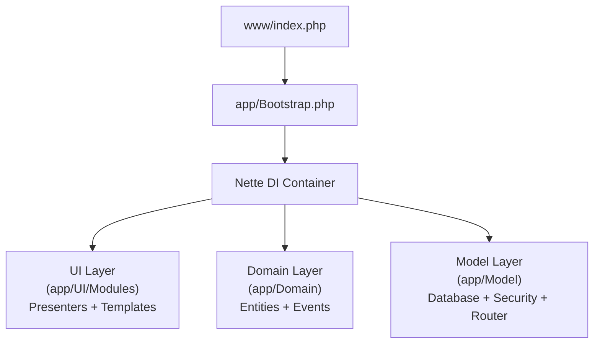
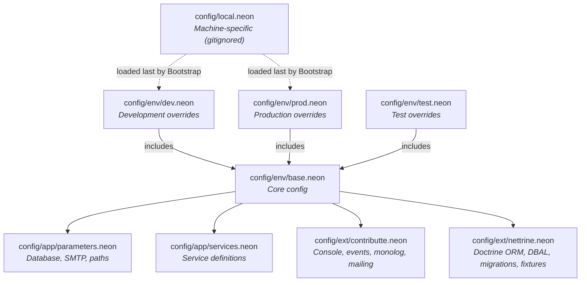
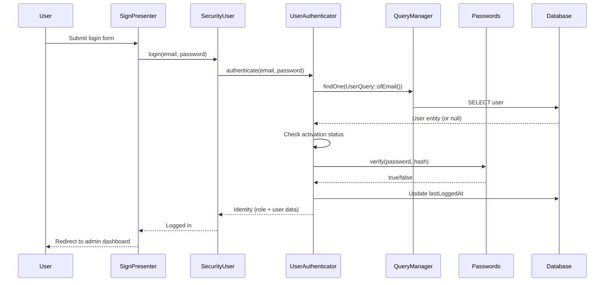

# Architecture Overview

This document describes the architecture of the webapp-skeleton project.

## Layered Architecture



- **UI Layer** (`app/UI/`) - Presenters, templates (Latte), forms, and reusable controls
- **Domain Layer** (`app/Domain/`) - Business entities, repositories, facades, and domain events
- **Model Layer** (`app/Model/`) - Infrastructure: database abstractions, security, routing, utilities

## Module System

The application is organized into 4 modules, each with its own route prefix:

| Module | URL prefix | Namespace | Purpose |
|--------|-----------|-----------|---------|
| Front | `/` | `App\UI\Modules\Front` | Public-facing pages |
| Admin | `/admin` | `App\UI\Modules\Admin` | Admin dashboard (secured) |
| Mailing | `/mailing` | `App\UI\Modules\Mailing` | Email template preview |
| Pdf | `/pdf` | `App\UI\Modules\Pdf` | PDF generation examples |

Module mapping is defined in `config/env/base.neon`:

```neon
application:
    mapping:
        Admin: [App\UI\Modules\Admin, *, *\*Presenter]
        Front: [App\UI\Modules\Front, *, *\*Presenter]
        Mailing: [App\UI\Modules\Mailing, *, *\*Presenter]
        Pdf: [App\UI\Modules\Pdf, *, *\*Presenter]
```

Routing is defined in `app/Model/Router/RouterFactory.php`. Each module gets its own `RouteList` with a URL prefix (e.g., `admin/<presenter>/<action>[/<id>]`). The Front module catches all remaining routes.

## Presenter Hierarchy

```mermaid
classDiagram
    class Presenter["Nette\\Application\\UI\\Presenter"]
    class BasePresenter {
        Uses: StructuredTemplates, TFlashMessage, TModuleUtils
        $template : TemplateProperty
        $user : SecurityUser
    }
    class SecuredPresenter {
        +checkRequirements() checks auth
        Redirects to sign-in if not logged in
    }
    class UnsecuredPresenter {
        Redirects to homepage if already logged in
    }
    class BaseAdminPresenter {
        Checks admin role permission
    }
    class BaseFrontPresenter

    Presenter <|-- BasePresenter
    BasePresenter <|-- SecuredPresenter
    BasePresenter <|-- UnsecuredPresenter
    BasePresenter <|-- BaseFrontPresenter
    SecuredPresenter <|-- BaseAdminPresenter
    BaseAdminPresenter <|-- AdminHomePresenter["Admin\\HomePresenter"]
    BaseAdminPresenter <|-- AdminSignPresenter["Admin\\SignPresenter"]
    BaseFrontPresenter <|-- FrontHomePresenter["Front\\HomePresenter"]
    BaseFrontPresenter <|-- FrontError4xxPresenter["Front\\Error4xxPresenter"]
```

Each module also has its own `@layout.latte` template that extends the base layout.

## Domain Layer Patterns

### Entities

Entities live in `app/Domain/{Aggregate}/` and use Doctrine ORM PHP 8 attributes for mapping. Common fields are provided by composable traits:

- `TId` - Auto-increment integer primary key
- `TCreatedAt` - Timestamp set on `PrePersist`
- `TUpdatedAt` - Timestamp set on `PreUpdate`

Example: `App\Domain\User\User` uses all three traits and defines fields like name, email, password hash, role, and state.

### Repository Pattern

Each entity has a repository extending `AbstractRepository` (which extends Doctrine's `EntityRepository`). The repository class is linked to the entity via the `#[ORM\Entity(repositoryClass: ...)]` attribute.

Example: `UserRepository` provides `findOneByEmail()`.

### Query Object Pattern

For complex queries, the skeleton uses a Query Object pattern:

- `AbstractQuery` holds an array of `$ons` callbacks (query modifiers)
- Static factory methods create pre-configured query objects
- `QueryManager` executes queries via Doctrine's `EntityManager`

```php
// Usage example:
$user = $this->queryManager->findOne(UserQuery::ofEmail('admin@admin.cz'));
```

### Event System

Uses Symfony EventDispatcher. Domain events are plain classes (e.g., `OrderCreated`). Subscribers (e.g., `OrderLogSubscriber`) listen to events with configurable priority using `getSubscribedEvents()`.

`RequestLoggerSubscriber` demonstrates listening to Nette application events for HTTP request logging.

## Configuration System

Configuration uses the NEON format with a layered approach:



`Bootstrap.php` selects the environment config based on the `NETTE_ENV` environment variable (`dev` or `prod`), then loads `config/local.neon` on top.

## Security System

### Authentication Flow



### Authorization

- `StaticAuthorizator` implements role-based access control
- `SecuredPresenter` checks `$user->isLoggedIn()` in `checkRequirements()`
- `BaseAdminPresenter` additionally checks `$user->isAdmin()`

### Roles and States

User entity defines:
- Roles: `ROLE_ADMIN`, `ROLE_USER`
- States: `STATE_FRESH`, `STATE_ACTIVATED`, `STATE_BLOCKED`

## Template Customization

The custom `TemplateFactory` (`app/Model/Latte/TemplateFactory.php`) modifies default Latte template variables:

- Removes default `$user` variable (to prevent misuse with raw Nette user object)
- Adds `$_user` - the `SecurityUser` instance
- Adds `$_template` - reference to the template itself
- Adds `$_filters` - `FilterExecutor` for calling Latte filters from PHP

## Entry Points

- **Web:** `www/index.php` calls `Bootstrap::runWeb()`, which creates the DI container and runs `Nette\Application\Application`
- **CLI:** `bin/console` calls `Bootstrap::runCli()`, which creates the DI container and runs `Symfony\Console\Application`

Both share the same bootstrap and configuration, differing only in the `scope` parameter (`web` vs `cli`).
