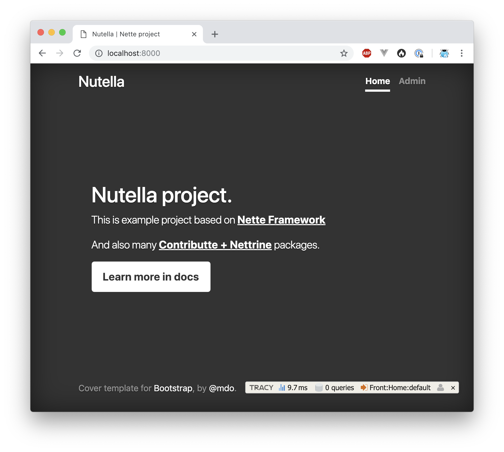
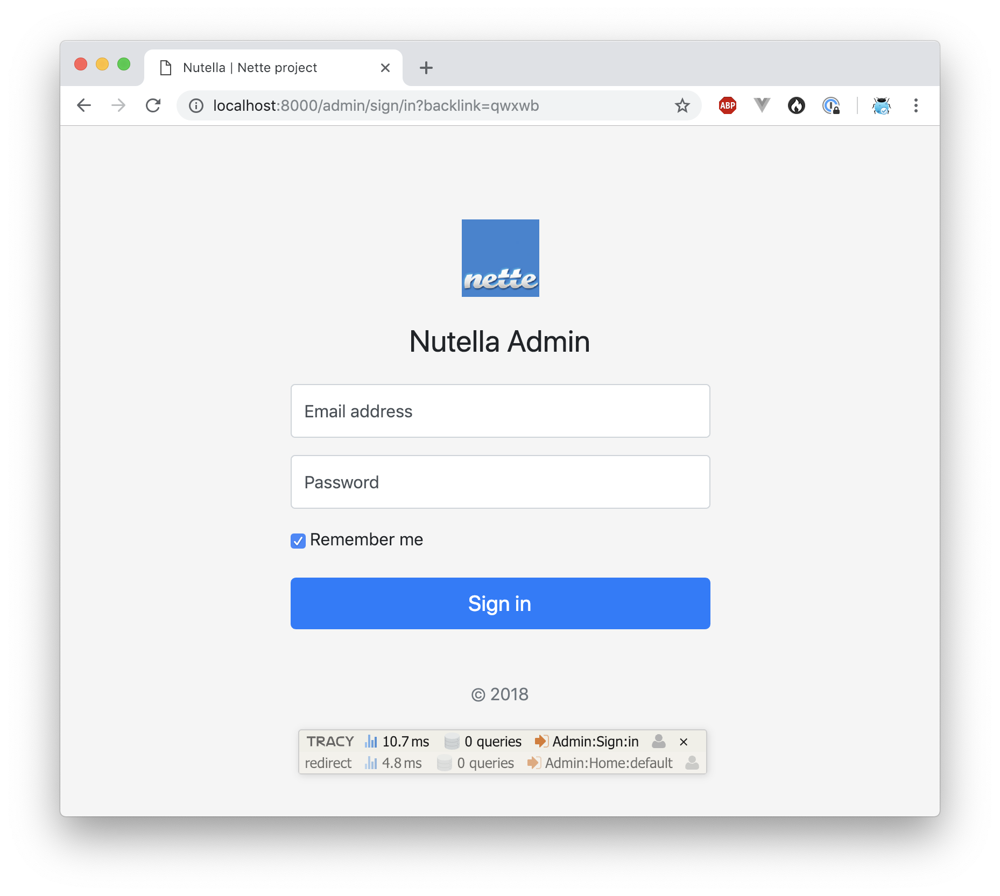
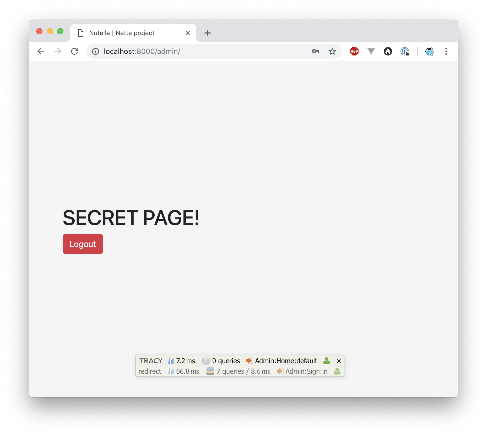
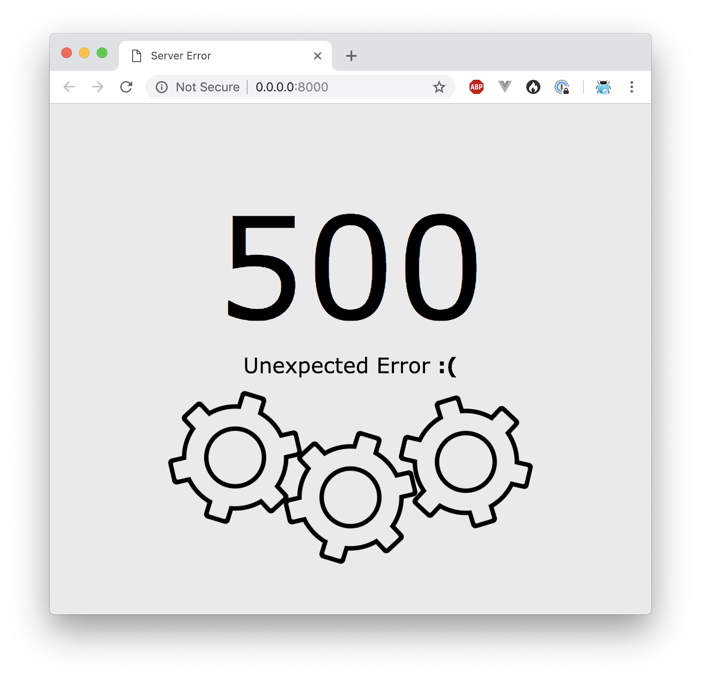

<p align=center>
  <a href="https://github.com/contributte/webapp-skeleton/actions"></a>
  <a href="https://coveralls.io/r/contributte/webapp-skeleton"></a>
  <a href="https://packagist.org/packages/contributte/webapp-skeleton"></a>
  <a href="https://packagist.org/packages/contributte/webapp-skeleton"></a>
</p>
<p align=center>
  <a href="https://packagist.org/packages/contributte/webapp-skeleton"></a>
  <a href="https://github.com/contributte/webapp-skeleton"></a>
  <a href="https://bit.ly/ctteg"></a>
  <a href="https://bit.ly/cttfo"></a>
  <a href="https://contributte.org/partners.html"></a>
</p>

<p align=center>
Website 🚀 <a href="https://contributte.org">contributte.org</a> | Contact 👨🏻‍💻 <a href="https://f3l1x.io">f3l1x.io</a> | Twitter 🐦 <a href="https://twitter.com/contributte">@contributte</a>
</p>

<p align=center>
    </img>
</p>

-----

## Goal

Main goal is to provide best prepared starter-kit project for Nette developers.

Focused on:

- PHP 8.1+
- `nette/*` packages
- Doctrine ORM via `nettrine/*`
- Symfony components via `contributte/*`
- codestyle checking via **CodeSniffer** and `contributte/qa`
- static analysing via **phpstan** and `contributte/phpstan`
- unit / integration tests via **Nette Tester** and `contributte/tester`

## Demo

https://examples.contributte.org/webapp-skeleton/

## Installation

To install latest version of `contributte/webapp-skeleton` use [Composer](https://getcomposer.org).

```
composer create-project -s dev contributte/webapp-skeleton acme
```

### Install using [docker](https://github.com/docker/docker/)

1) At first, use composer to install this project.

   ```
   composer create-project -s dev contributte/webapp-skeleton
   ```

2) After that, you have to setup Postgres >= 10 database. You can start it manually or use docker image `dockette/postgres:12`.

   ```
   docker run -it -p 5432:5432 -e POSTGRES_PASSWORD=webapp -e POSTGRES_USER=webapp dockette/postgres:12
   ```

   Or use make task, `make docker-postgres`.

3) Custom configuration file is located at `config/local.neon`. Edit it if you want.

   Default configuration should look like:

   ```neon
   # Host Config
   parameters:
       # Database
       database:
           host: localhost
           dbname: webapp
           user: webapp
           password: webapp
   ```

4) Ok database is now running and application is configured to connect to it. Let's create initial data.

   Run `NETTE_DEBUG=1 bin/console migrations:migrate` to create tables. Run `NETTE_DEBUG=1 bin/console doctrine:fixtures:load --append` to create first user(s).

   Or via task `make build`.

5) Start your devstack or use PHP local development server.

   You can start PHP server by running `php -S localhost:8000 -t www` or use prepared make task `make dev`.

6) Open http://localhost and enjoy!

   Take a look at:
    - http://localhost:8000.
    - http://localhost:8000/admin (admin@admin.cz / admin)

### Install using [docker-compose](https://https://github.com/docker/compose/)

1) At first, use composer to install this project.

   ```
   composer create-project -s dev contributte/webapp-project
   ```

2) Modify `config/local.neon` and set host to `database`

   Default configuration should look like this:

   ```neon
   # Host Config
   parameters:
       # Database
       database:
           host: database
           dbname: webapp
           user: webapp
           password: webapp
   ```

3) Run `docker-compose up`

4) Open http://localhost and enjoy!

   Take a look at:
    - http://localhost.
    - http://localhost/admin (admin@admin.cz / admin)

## Features

Here is a list of all features you can find in this project.

- PHP 8.0+
- :package: Packages
    - Nette 3+
    - Contributte
    - Nettrine
- :deciduous_tree: Structure
    - `app`
        - `config` - configuration files
            - `env` - prod/dev/test environments
            - `app` - application configs
            - `ext` - extensions configs
            - `local.neon` - local runtime config
            - `local.neon.dist` - template for local config
        - `domain` - business logic and domain specific classes
        - `model` - application backbone
        - `modules` - Front/Admin module, presenters and components
        - `resources` - static content for mails and others
        - `ui` - UI components and base classes
        - `bootstrap.php` - Nette entrypoint
    - `bin` - console entrypoint (`bin/console`)
    - `db` - database files
        - `fixtures` - PHP fixtures
        - `migrations` - migrations files
    - `docs` - documentation
    - `var`
        - `log` - runtime and error logs
        - `tmp` - tmp files and cache
    - `tests` - test engine and unit/integration tests
    - `vendor` - composer's folder
    - `www` - public content
- :exclamation: Tracy
    - Cool error 500 page

### Notable changes

- `$user` variable in templates [is renamed](https://github.com/contributte/webapp-skeleton/blob/master/app/model/Latte/TemplateFactory.php) to `$_user`

### Composer packages

Take a detailed look :eyes: at each single package.

- [contributte/bootstrap](https://contributte.org/packages/contributte/bootstrap.html)
- [contributte/application](https://contributte.org/packages/contributte/application.html)
- [contributte/di](https://contributte.org/packages/contributte/di.html)
- [contributte/cache](https://contributte.org/packages/contributte/cache.html)
- [contributte/http](https://contributte.org/packages/contributte/http.html)
- [contributte/forms](https://contributte.org/packages/contributte/forms.html)
- [contributte/latte](https://contributte.org/packages/contributte/latte.html)
- [contributte/mail](https://contributte.org/packages/contributte/mail.html)
- [contributte/security](https://contributte.org/packages/contributte/security.html)
- [contributte/utils](https://contributte.org/packages/contributte/utils.html)
- [contributte/tracy](https://contributte.org/packages/contributte/tracy.html)
- [contributte/console](https://contributte.org/packages/contributte/console.html)
- [contributte/webapp-skeleton](https://contributte.org/packages/contributte/webapp-skeleton.html)
- [contributte/event-dispatcher](https://contributte.org/packages/contributte/event-dispatcher.html)
- [contributte/event-dispatcher-extra](https://contributte.org/packages/contributte/event-dispatcher-extra.html)
- [contributte/neonizer](https://contributte.org/packages/contributte/neonizer.html)
- [contributte/mailing](https://contributte.org/packages/contributte/mailing.html)
- [contributte/monolog](https://contributte.org/packages/contributte/monolog.html)

**Doctrine**

- [contributte/doctrine-orm](https://contributte.org/packages/contributte/doctrine-orm.html)
- [contributte/doctrine-dbal](https://contributte.org/packages/contributte/doctrine-dbal.html)
- [contributte/doctrine-annotations](https://contributte.org/packages/contributte/doctrine-annotations.html)
- [contributte/doctrine-cache](https://contributte.org/packages/contributte/doctrine-cache.html)
- [contributte/doctrine-migrations](https://contributte.org/packages/contributte/doctrine-migrations.html)
- [contributte/doctrine-fixtures](https://contributte.org/packages/contributte/doctrine-fixtures.html)

**Dev**

- [contributte/dev](https://contributte.org/packages/contributte/dev.html)
- [ninjify/qa](https://contributte.org/packages/ninjify/qa.html)
- [ninjify/nunjuck](https://contributte.org/packages/ninjify/nunjuck.html)
- [phpstan/phpstan](https://github.com/phpstan/phpstan)
- [mockery/mockery](https://github.com/mockery/mockery)
- [nelmio/alice](https://github.com/nelmio/alice)

## Screenshots



> admin@admin.cz / admin





## Development

See [how to contribute](https://contributte.org/contributing.html) to this package.

This package is currently maintaining by these authors.

<a href="https://github.com/f3l1x">
    
</a>

-----

Consider to [support](https://contributte.org/partners.html) **contributte** development team. Also thank you for using this project.
