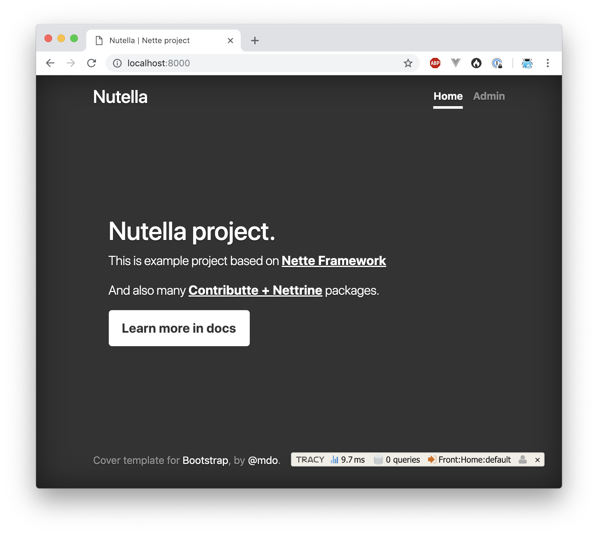
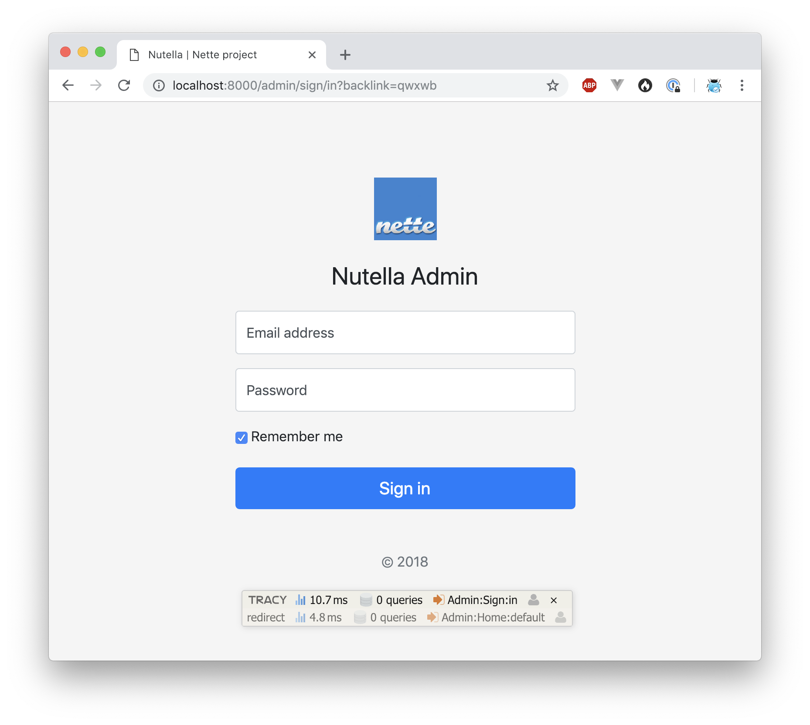
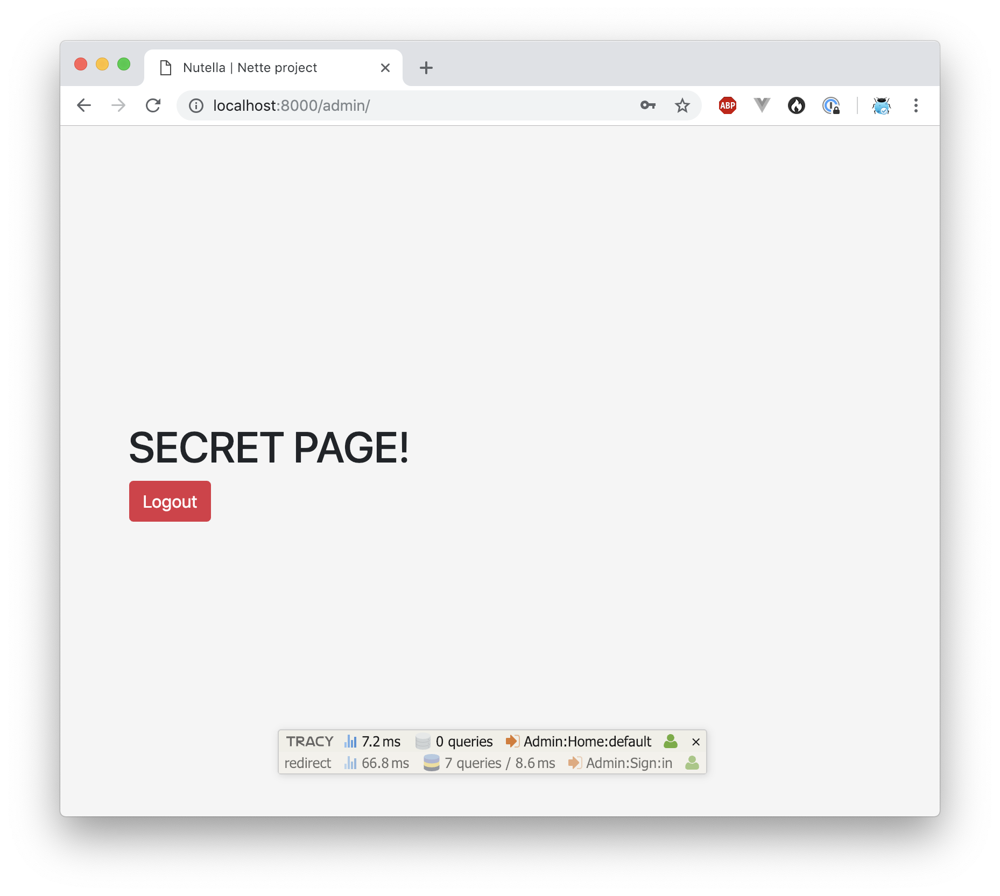
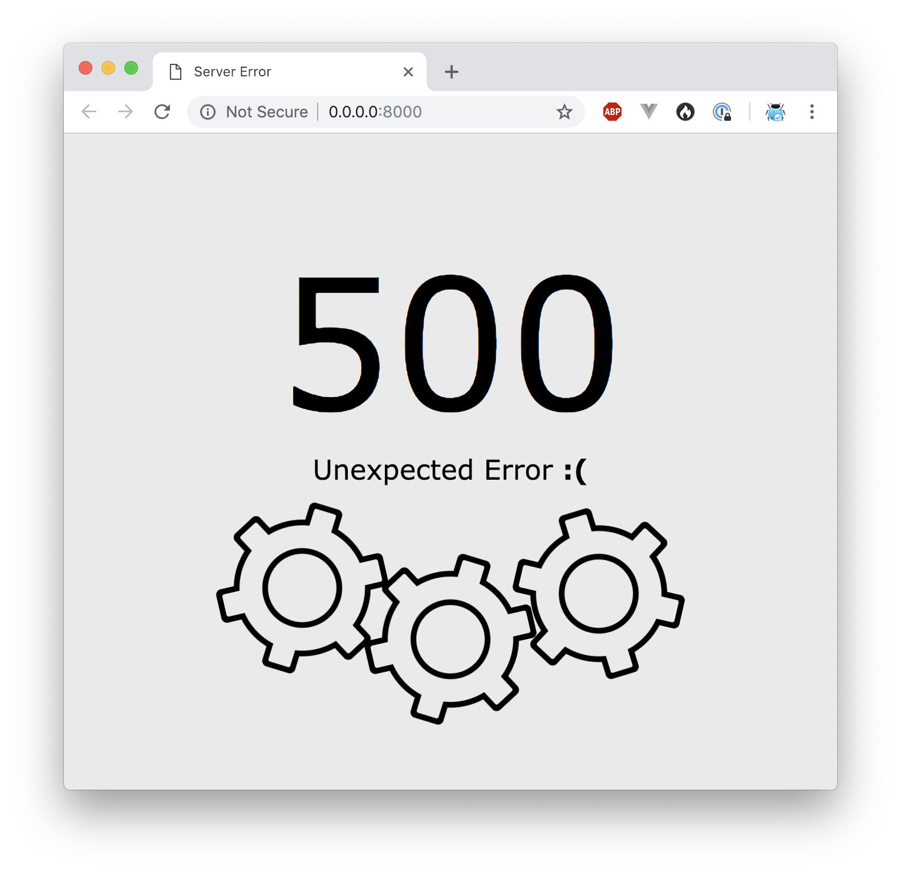

<p align=center>
  <a href="https://github.com/contributte/webapp-skeleton/actions"></a>
  <a href="https://codecov.io/gh/contributte/webapp-skeleton"></a>
  <a href="https://packagist.org/packages/contributte/webapp-skeleton"></a>
  <a href="https://packagist.org/packages/contributte/webapp-skeleton"></a>
</p>
<p align=center>
  <a href="https://packagist.org/packages/contributte/webapp-skeleton"></a>
  <a href="https://github.com/contributte/webapp-skeleton"></a>
  <a href="https://bit.ly/ctteg"></a>
  <a href="https://bit.ly/cttfo"></a>
  <a href="https://contributte.org/partners.html"></a>
</p>

<p align=center>
Website 🚀 <a href="https://contributte.org">contributte.org</a> | Contact 👨🏻‍💻 <a href="https://f3l1x.io">f3l1x.io</a> | Twitter 🐦 <a href="https://twitter.com/contributte">@contributte</a>
</p>

<p align=center>
    </img>
</p>

-----

## Goal

Main goal is to provide best prepared starter-kit project for Nette developers.

Focused on:

- PHP 8.4+
- `nette/*` packages
- Doctrine ORM via `nettrine/*`
- Symfony components via `contributte/*`
- codestyle checking via **CodeSniffer** and `contributte/qa`
- static analysing via **phpstan** and `contributte/phpstan`
- unit / integration tests via **Nette Tester** and `contributte/tester`

## Demo

https://examples.contributte.org/webapp-skeleton/

## Quick Start

```bash
composer create-project -s dev contributte/webapp-skeleton acme
cd acme
cp config/local.neon.example config/local.neon  # or: make init
make project                                     # composer install + setup dirs
# Start PostgreSQL (see Docker section below)
make build                                       # run migrations + load fixtures
make dev                                         # start PHP dev server on port 8000
```

Open http://localhost:8000 and enjoy!

> **Default credentials:**
> - **Database:** `contributte` / `contributte` (host: `0.0.0.0`, dbname: `contributte`)
> - **Admin login:** `admin@admin.cz` / `admin`

## Makefile Commands

| Command | Description |
|---------|-------------|
| `make project` | Full setup: install + setup |
| `make init` | Copy `local.neon.example` to `local.neon` |
| `make install` | Run `composer install` |
| `make setup` | Create `var/tmp` and `var/log` directories |
| `make clean` | Remove all temp and log files |
| `make qa` | Run CodeSniffer + PHPStan |
| `make cs` | Run CodeSniffer on `app` and `tests` |
| `make csf` | Run CodeFixer on `app` and `tests` |
| `make phpstan` | Run PHPStan static analysis |
| `make tests` | Run Nette Tester |
| `make coverage` | Run tests with coverage report |
| `make dev` | Start PHP dev server on `0.0.0.0:8000` |
| `make build` | Drop DB schema, run migrations, load fixtures |
| `make deploy` | Full deployment: clean -> project -> build -> clean |
| `make docker-postgres` | Start PostgreSQL 12 container |
| `make docker-adminer` | Start Adminer on port 9999 |

## Installation

To install latest version of `contributte/webapp-skeleton` use [Composer](https://getcomposer.org).

```
composer create-project -s dev contributte/webapp-skeleton acme
```

### Install using [docker](https://github.com/docker/docker/)

1) At first, use composer to install this project.

   ```
   composer create-project -s dev contributte/webapp-skeleton
   ```

2) After that, you have to setup Postgres >= 10 database. You can start it manually or use docker image `dockette/postgres:12`.

   ```
   docker run -it -p 5432:5432 -e POSTGRES_PASSWORD=contributte -e POSTGRES_USER=contributte dockette/postgres:12
   ```

   Or use make task, `make docker-postgres`.

3) Custom configuration file is located at `config/local.neon`. Edit it if you want.

   Default configuration should look like:

   ```neon
   # Host Config
   parameters:
       # Database
       database:
           host: localhost
           dbname: contributte
           user: contributte
           password: contributte
   ```

4) Ok database is now running and application is configured to connect to it. Let's create initial data.

   Run `NETTE_DEBUG=1 bin/console migrations:migrate` to create tables. Run `NETTE_DEBUG=1 bin/console doctrine:fixtures:load --append` to create first user(s).

   Or via task `make build`.

5) Start your devstack or use PHP local development server.

   You can start PHP server by running `php -S localhost:8000 -t www` or use prepared make task `make dev`.

6) Open http://localhost and enjoy!

   Take a look at:
    - http://localhost:8000.
    - http://localhost:8000/admin (admin@admin.cz / admin)

### Install using [docker-compose](https://github.com/docker/compose/)

1) At first, use composer to install this project.

   ```
   composer create-project -s dev contributte/webapp-skeleton
   ```

2) Modify `config/local.neon` and set host to `database`

   Default configuration should look like this:

   ```neon
   # Host Config
   parameters:
       # Database
       database:
           host: database
           dbname: webapp
           user: webapp
           password: webapp
   ```

3) Run `docker-compose up`

4) Open http://localhost and enjoy!

   Take a look at:
    - http://localhost.
    - http://localhost/admin (admin@admin.cz / admin)

## Features

Here is a list of all features you can find in this project.

- PHP 8.4+
- :package: Packages
    - Nette 3+
    - Contributte
    - Nettrine
- :deciduous_tree: Structure
    - `app`
        - `Bootstrap.php` - Nette entrypoint
        - `Console` - CLI commands
        - `Domain` - business logic and domain specific classes
        - `Model` - application backbone (Database, Security, Router, Latte, Utils)
        - `UI` - presenters, templates and components
            - `Control` - reusable UI controls
            - `Form` - form factory
            - `Modules` - Front/Admin/Mailing/Pdf modules
    - `bin` - console entrypoint (`bin/console`)
    - `config` - configuration files
        - `app` - application configs (parameters.neon, services.neon)
        - `env` - prod/dev/test environments (base.neon, dev.neon, prod.neon, test.neon)
        - `ext` - extension configs (contributte.neon, nettrine.neon)
        - `local.neon` - local runtime config (gitignored)
        - `local.neon.example` - template for local config
    - `db` - database files
        - `Fixtures` - PHP fixtures
        - `Migrations` - migration files
    - `.docs` - documentation assets
    - `resources` - static content for mails and others
    - `tests` - test engine and unit/integration tests
    - `var`
        - `log` - runtime and error logs
        - `tmp` - tmp files and cache
    - `vendor` - composer's folder
    - `www` - public content
- :exclamation: Tracy
    - Cool error 500 page

### Notable changes

- `$user` variable in templates [is renamed](https://github.com/contributte/webapp-skeleton/blob/master/app/Model/Latte/TemplateFactory.php) to `$_user`

### Composer packages

Take a detailed look :eyes: at each single package.

- [contributte/bootstrap](https://github.com/contributte/bootstrap)
- [contributte/application](https://github.com/contributte/application)
- [contributte/di](https://github.com/contributte/di)
- [contributte/cache](https://github.com/contributte/cache)
- [contributte/http](https://github.com/contributte/http)
- [contributte/forms](https://github.com/contributte/forms)
- [contributte/latte](https://github.com/contributte/latte)
- [contributte/mail](https://github.com/contributte/mail)
- [contributte/security](https://github.com/contributte/security)
- [contributte/utils](https://github.com/contributte/utils)
- [contributte/tracy](https://github.com/contributte/tracy)
- [contributte/console](https://github.com/contributte/console)
- [contributte/webapp-skeleton](https://github.com/contributte/webapp-skeleton)
- [contributte/event-dispatcher](https://github.com/contributte/event-dispatcher)
- [contributte/event-dispatcher-extra](https://github.com/contributte/event-dispatcher-extra)
- [contributte/neonizer](https://github.com/contributte/neonizer)
- [contributte/mailing](https://github.com/contributte/mailing)
- [contributte/monolog](https://github.com/contributte/monolog)

**Doctrine**

- [contributte/doctrine-orm](https://github.com/contributte/doctrine-orm)
- [contributte/doctrine-dbal](https://github.com/contributte/doctrine-dbal)
- [contributte/doctrine-annotations](https://github.com/contributte/doctrine-annotations)
- [contributte/doctrine-cache](https://github.com/contributte/doctrine-cache)
- [contributte/doctrine-migrations](https://github.com/contributte/doctrine-migrations)
- [contributte/doctrine-fixtures](https://github.com/contributte/doctrine-fixtures)

**Dev**

- [contributte/qa](https://github.com/contributte/qa)
- [contributte/tester](https://github.com/contributte/tester)
- [contributte/phpstan](https://github.com/contributte/phpstan)
- [contributte/dev](https://github.com/contributte/dev)
- [phpstan/phpstan-doctrine](https://github.com/phpstan/phpstan-doctrine)
- [mockery/mockery](https://github.com/mockery/mockery)
- [nelmio/alice](https://github.com/nelmio/alice)

## Screenshots



> admin@admin.cz / admin





## Documentation

- [Architecture Overview](.docs/architecture.md) - Layered architecture, module system, design patterns
- [Database Guide](.docs/database.md) - Entities, migrations, fixtures, query objects
- [Troubleshooting](.docs/troubleshooting.md) - Common issues and solutions
- [Testing Guide](.docs/testing.md) - Running and writing tests

## Development

See [how to contribute](https://contributte.org/contributing.html) to this package. Also see [CONTRIBUTING.md](CONTRIBUTING.md).

This package is currently maintaining by these authors.

<a href="https://github.com/f3l1x">
    
</a>

-----

Consider to [support](https://contributte.org/partners.html) **contributte** development team. Also thank you for using this project.
