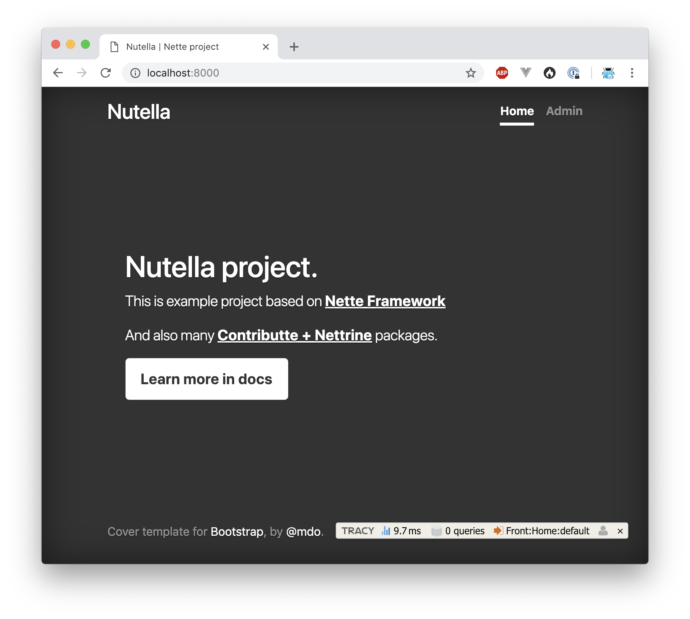
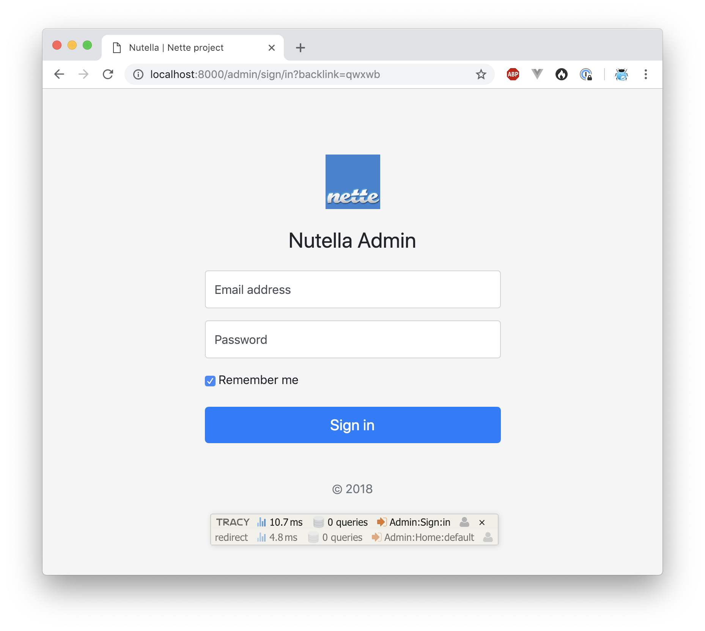
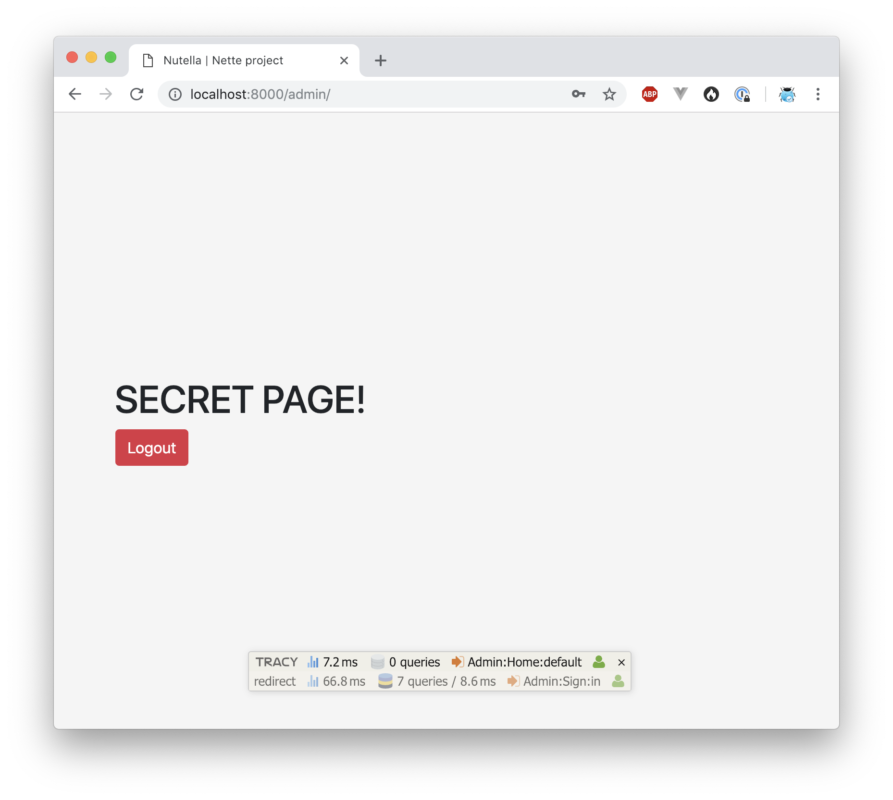
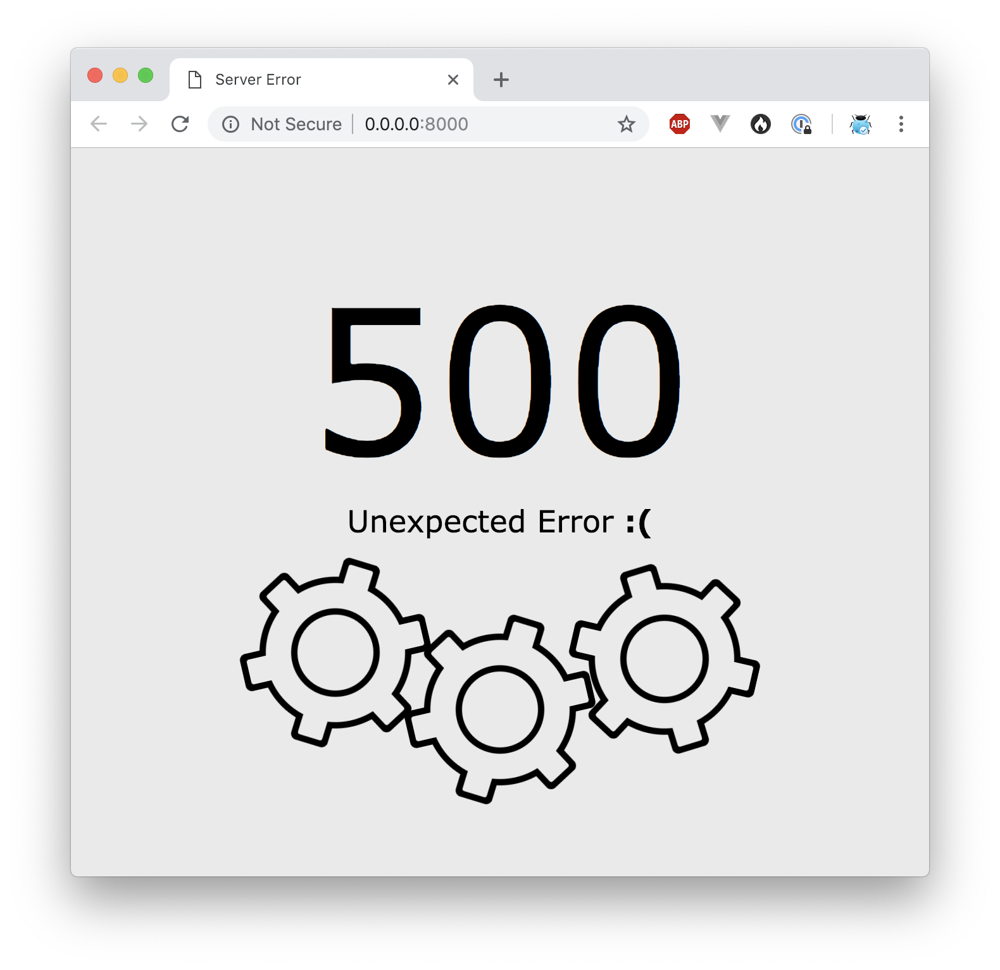

<p align=center>
  <a href="https://github.com/contributte/webapp-skeleton/actions"></a>
  <a href="https://codecov.io/gh/contributte/webapp-skeleton"></a>
  <a href="https://packagist.org/packages/contributte/webapp-skeleton"></a>
  <a href="https://packagist.org/packages/contributte/webapp-skeleton"></a>
</p>
<p align=center>
  <a href="https://packagist.org/packages/contributte/webapp-skeleton"></a>
  <a href="https://github.com/contributte/webapp-skeleton"></a>
  <a href="https://bit.ly/ctteg"></a>
  <a href="https://bit.ly/cttfo"></a>
  <a href="https://contributte.org/partners.html"></a>
</p>

<p align=center>
Website 🚀 <a href="https://contributte.org">contributte.org</a> | Contact 👨🏻‍💻 <a href="https://f3l1x.io">f3l1x.io</a> | Twitter 🐦 <a href="https://twitter.com/contributte">@contributte</a>
</p>

<p align=center>
  </img>
</p>

-----

## Goal

Webapp Skeleton is a starter project for a Nette Framework web application. It gives you a front module, an admin
module with sign-in, Doctrine ORM on PostgreSQL, console commands, mailing and PDF examples, already configured and
checked in CI, so you start from working code instead of an empty folder.

It is built on:

- PHP 8.4 or later and `nette/*` packages
- Doctrine ORM, DBAL, migrations and fixtures via `nettrine/*`
- Symfony Console and EventDispatcher via `contributte/console` and `contributte/event-dispatcher`
- Mail, PDF, logging and Tracy via `contributte/mailing`, `contributte/pdf`, `contributte/monolog` and `contributte/tracy`
- Code style via CodeSniffer and `contributte/qa`, static analysis via PHPStan and `contributte/phpstan`
- Tests via Nette Tester and `contributte/tester`

## Demo

https://examples.contributte.org/webapp-skeleton/

## Installation

Create a new project with [Composer](https://getcomposer.org):

```bash
composer create-project -s dev contributte/webapp-skeleton acme
```

Requires PHP 8.4 or later and PostgreSQL.

## Startup

Create the runtime folders and your local config, `config/local.neon`, with the database connection:

```bash
make setup
make init
```

Start PostgreSQL on port 5432 with the `contributte` / `contributte` credentials. The container runs in the
foreground, so keep it open:

```bash
make docker-postgres
```

In a second terminal, create the tables and the first user, then run the built-in server on http://localhost:8000:

```bash
make build
make dev
```

> [!WARNING]
> `make build` drops every table in the configured database before it runs the migrations. Use it only on a
> local database.

Sign in to the admin at http://localhost:8000/admin with `admin@admin.cz` / `admin`.

You can also run Nginx, PHP-FPM and PostgreSQL with Docker Compose. Set `host: database` in `config/local.neon`
first, then start the stack on http://localhost:8080:

```bash
docker compose up
```

The `php` container installs dependencies, runs the migrations and reloads the fixtures on every start. Known
limits of the skeleton, including port and version conflicts in `docker-compose.yml`, are listed in
[TECH.md](TECH.md#known-limits).

## Features

- Front module with a home page and 403, 404, 405, 410 and generic 4xx error pages
- Admin module with sign-in, sign-out, a role check and an order form that dispatches an event
- `User` entity, repository, query object, facade, migration and fixture
- `bin/console` with an example `hello` command and the Doctrine, migrations and fixtures commands
- Templated e-mail via `contributte/mailing` and a PDF example via `contributte/pdf`
- Monolog logging to `var/log` and a static Tracy error page for production
- `$user` in templates is renamed to `$_user` by [`TemplateFactory`](app/Model/Latte/TemplateFactory.php)

The folder layout, configuration and request flow are described in [TECH.md](TECH.md), the scope in [PRD.md](PRD.md).

Each bundled package has its own documentation on contributte.org:

- [contributte/application](https://contributte.org/packages/contributte/application.html),
  [contributte/bootstrap](https://contributte.org/packages/contributte/bootstrap.html),
  [contributte/di](https://contributte.org/packages/contributte/di.html),
  [contributte/cache](https://contributte.org/packages/contributte/cache.html),
  [contributte/http](https://contributte.org/packages/contributte/http.html),
  [contributte/forms](https://contributte.org/packages/contributte/forms.html),
  [contributte/latte](https://contributte.org/packages/contributte/latte.html),
  [contributte/security](https://contributte.org/packages/contributte/security.html),
  [contributte/utils](https://contributte.org/packages/contributte/utils.html),
  [contributte/tracy](https://contributte.org/packages/contributte/tracy.html)
- [contributte/console](https://contributte.org/packages/contributte/console.html),
  [contributte/console-extra](https://github.com/contributte/console-extra),
  [contributte/event-dispatcher](https://contributte.org/packages/contributte/event-dispatcher.html),
  [contributte/event-dispatcher-extra](https://contributte.org/packages/contributte/event-dispatcher-extra.html),
  [contributte/mail](https://contributte.org/packages/contributte/mail.html),
  [contributte/mailing](https://contributte.org/packages/contributte/mailing.html),
  [contributte/monolog](https://contributte.org/packages/contributte/monolog.html),
  [contributte/pdf](https://github.com/contributte/pdf)
- [nettrine/orm](https://contributte.org/packages/contributte/doctrine-orm.html),
  [nettrine/dbal](https://contributte.org/packages/contributte/doctrine-dbal.html),
  [nettrine/annotations](https://contributte.org/packages/contributte/doctrine-annotations.html),
  [nettrine/cache](https://contributte.org/packages/contributte/doctrine-cache.html),
  [nettrine/migrations](https://contributte.org/packages/contributte/doctrine-migrations.html),
  [nettrine/fixtures](https://contributte.org/packages/contributte/doctrine-fixtures.html)
- Development: [contributte/qa](https://github.com/contributte/qa),
  [contributte/phpstan](https://github.com/contributte/phpstan),
  [contributte/tester](https://github.com/contributte/tester),
  [contributte/dev](https://contributte.org/packages/contributte/dev.html),
  [mockery/mockery](https://github.com/mockery/mockery),
  [nelmio/alice](https://github.com/nelmio/alice)

## Screenshots

The front home page:



The admin sign-in, with `admin@admin.cz` / `admin`:



The secured admin page and the production error page:




## Development

See [how to contribute](https://contributte.org/contributing.html) to this package.

This package is currently maintained by these authors.

<a href="https://github.com/f3l1x">
  
</a>

-----

Consider [supporting](https://contributte.org/partners.html) the **contributte** development team.
Thank you for using this package.
